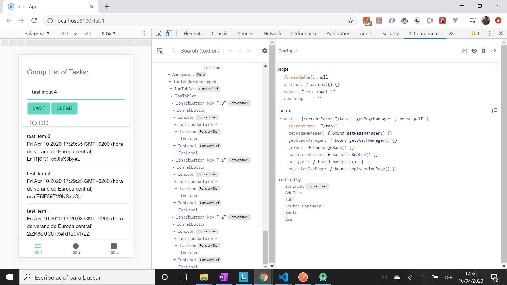
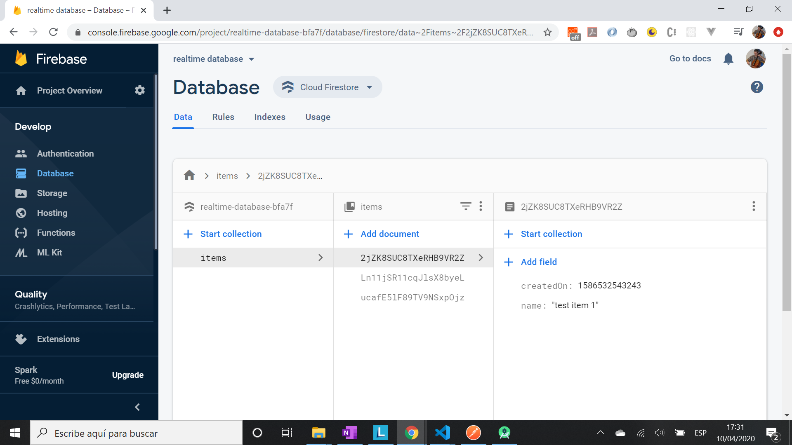
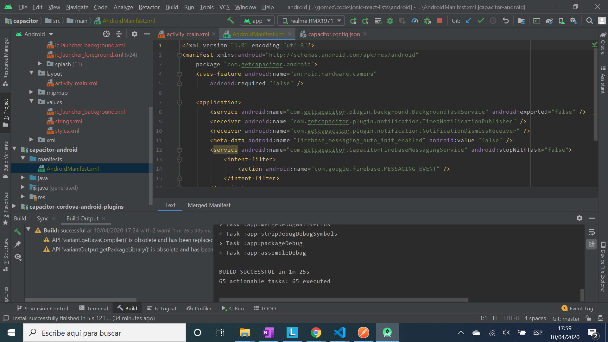
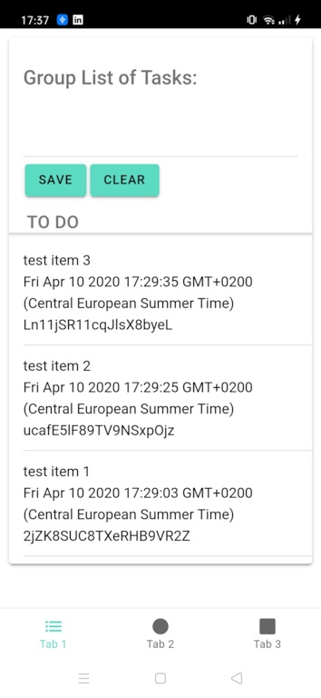

# :zap: Angular React Lists

* App using Ionic with React to store todo list items in a Firebase backend. App run successfully on an actual mobile device using Android Studio v3.6.2. Code from tutorial by [Daniel Hampikian](https://www.youtube.com/watch?v=-RtrbNJxOfQ) with custom code to hide Firebase database access data from Github.
* **Note:** to open web links in a new window use: _ctrl+click on link_


## :page_facing_up: Table of contents

* [:zap: Angular React Lists](#zap-angular-react-lists)
  * [:page_facing_up: Table of contents](#page_facing_up-table-of-contents)
  * [:books: General info](#books-general-info)
  * [:camera: Screenshots](#camera-screenshots)
  * [:signal_strength: Technologies](#signal_strength-technologies)
  * [:floppy_disk: Setup - Development](#floppy_disk-setup---development)
  * [:floppy_disk: Setup - Build, Android Studio](#floppy_disk-setup---build-android-studio)
  * [:computer: Code Examples](#computer-code-examples)
  * [:cool: Features](#cool-features)
  * [:clipboard: Status & To-Do List](#clipboard-status--to-do-list)
  * [:clap: Inspiration](#clap-inspiration)
  * [:file_folder: License](#file_folder-license)
  * [:envelope: Contact](#envelope-contact)

## :books: General info

* Simple database app that allows multiple users to Create, Read, Update and Delete (CRUD) text items to a Google Firebase database from PC or phone etc.

## :camera: Screenshots






## :signal_strength: Technologies

* [Ionic/React v5](https://www.npmjs.com/package/@ionic/react) used to create app
* [React v17](https://reactjs.org/) JavaScript library
* [Capacitor Android v2](https://capacitor.ionicframework.com/docs/) cross-platform app run-time
* [Google Cloud Firestore](https://firebase.google.com/products/firestore) to store Todo items in a backend database
* [Android Studio v3](https://developer.android.com/studio) to create Android app
* [React Dev Tools Chrome extension](https://chrome.google.com/webstore/detail/react-developer-tools/fmkadmapgofadopljbjfkapdkoienihi/related) to help with debugging etc.

## :floppy_disk: Setup - Development

* Install dependencies using `npm i`
* Add your own firestore config data file or install npm dotenv etc.
* Run `ionic serve` to open the dev server at `http://localhost:8100/`

## :floppy_disk: Setup - Build, Android Studio

* Run `ionic build` to create build files
* If you don't have it already then Install Android Studio (on Windows 10 in my case - see 'Inspiration' for helpful video)
* Run `npx cap open android` to start app in Android Studio
* Connect mobile device to Android Studio via USB. To go into dev mode on Realme 5 Pro mobile phone connected via USB to Android: Go to 'About Phone'/'Version Baseband & Kernal' in phone settings then click 7 times on 'Version' and enter phone access code. Go to Settings/Additional Settings/Developer options and enable 'USB debugging'

## :computer: Code Examples

* extract from `ItemList` function with todo item and edit and delete sliding buttons

```javascript
<IonList id="list">
  {value &&
    value.docs.map((doc) => {
      return (
        !loading && (
          <Item
            doc={doc}
            doEdit={(i) => {
              closeSlidingItems();
              doEdit(i);
            }}
            doDelete={(i) => {
              closeSlidingItems();
              doDelete(i);
            }}
            key={doc.id}
          />
        )
      );
    })}
</IonList>
```

## :cool: Features

* Android Studio used to run app on an actual phone (Realme 5 Pro)

## :clipboard: Status & To-Do List

* Status: Working app, run successfully on an Android mobile device. Updated april 2021
* To-Do: Use to develop a more complex app

## :clap: Inspiration

* [Daniel Hampikian Youtube Video: How to make an ionic 5 react app with firebase cloud firestore and capacitor: mobile and web app dev](https://www.youtube.com/watch?v=-RtrbNJxOfQ)
* [Tim Buchalka Youtube video: Windows - Install Android Studio](https://www.youtube.com/watch?v=xrCr0A9DIMw)

## :file_folder: License

* This project is licensed under the terms of the MIT license.

## :envelope: Contact

* Repo created by [ABateman](https://github.com/AndrewJBateman), email: gomezbateman@yahoo.com
